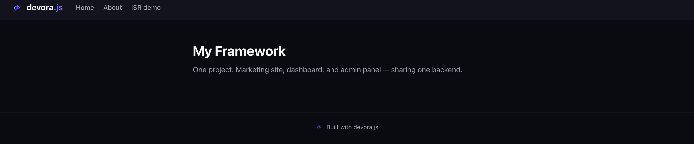
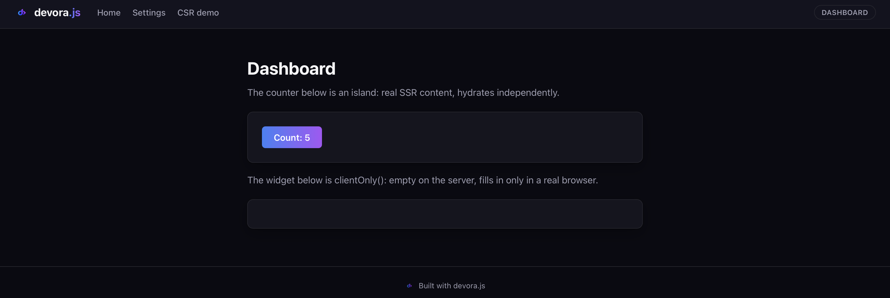
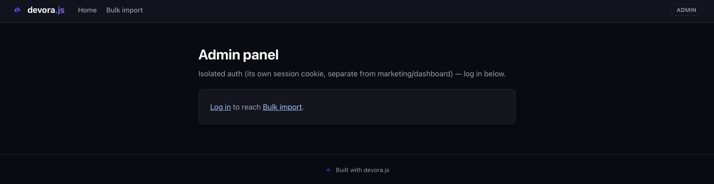

# Devora.js

[](https://github.com/hassanalsa3aka/devora.js/actions/workflows/ci.yml)
[](LICENSE)

A Vite-based React framework built around one idea : **a project is more than one app.**

Devora.js lets you define several apps in one repo — a marketing site, a product app, an admin
panel — that share a core and a backend, but build and deploy independently. Each app gets its
own render mode, its own auth mode, and its own deploy target, without duplicating the plumbing
between them.

## Why

Most React frameworks assume one app per project. The moment a real product needs a marketing
site, a product app, and an admin panel — a pretty normal shape — you're either cramming them
into one app with route groups, or maintaining separate repos that share nothing. Devora.js
treats "one repo, several independently-deployed apps sharing a core" as the default, not a
workaround bolted on later.

The other design choice: no implicit caching. Every render mode (`ssr`/`ssg`/`csr`/`isr`) is an
explicit, route-level opt-in — no hidden revalidation windows to reverse-engineer, no undocumented
build format standing between you and a plain reverse proxy if you ever need one.

## Live demo

- Vercel: [marketing](https://devora-js-marketing.vercel.app) ·
  [dashboard](https://devora-js-dashboard.vercel.app) ·
  [admin](https://devora-js-admin.vercel.app)
- Netlify: [marketing](https://devorajs.netlify.app) ·
  [dashboard](https://devora-dashboard.netlify.app) ·
  [admin](https://devora-admin.netlify.app)
- Docs site, built with the published npm packages rather than this monorepo:
  [devorajs-docs-docs.vercel.app](https://devorajs-docs-docs.vercel.app)

## Screenshots

The same shared header/theme (`<PageShell>`) across all three apps — one design, not three ad
hoc ones.

**Marketing** (`auth: "none"` — no login anywhere on this app)


**Dashboard** (`auth: "shared"` — an island counter and a `clientOnly()` widget)


**Admin** (`auth: "isolated"` — its own session cookie, separate from the other two)


## Quickstart

```bash
git clone https://github.com/hassanalsa3aka/devora.js.git
cd devora.js
pnpm install
pnpm exec devora dev --app=dashboard
```

Or start a brand-new standalone project, outside this repo:

```bash
npm create devora@latest
```

npm and Yarn work too, not just pnpm — see `VERIFICATION.md` for what's actually been tested
under each.

## Key features

- **Multi-app, one repo** — `devora.config.ts` declares each app; `devora build`/`devora deploy`
  handle each one independently.
- **SSR, SSG, CSR, ISR, streaming** — set per route, explicitly.
- **Islands** — `island(() => import("./Widget"))` hydrates just that component; the rest of the
  page stays static HTML.
- **Sessions & CSRF built in** — three auth modes per app: `shared`, `isolated`, or `none` (skip
  the whole cookie/session carrier for apps that don't need login, like a marketing site).
- **Security headers on by default** — CSP, HSTS, X-Frame-Options, overridable per app.
- **SEO** — OG tags and an auto-generated `sitemap.xml`, opt-in per app.
- **Dynamic routes** — `routes/users/[id].tsx` matches `/users/123`, with the value available as
  `ctx.params.id`. A static route at the same depth always wins over a dynamic one.
- **Backend modules & generic API routes (v2)** — `defineModule()` organizes shared backend logic
  with no DI container, ever; `apiRoute()` handlers live under `apps/<name>/api/**`, matched by the
  same file-based router as page routes — a payment-provider webhook finally has somewhere to live
  that isn't a page's `loader`/`action`.
- **Middleware (v2)** — native `withMiddleware()` composition, plus optional
  `fromExpressMiddleware()`/`fromFastifyPlugin()` adapters for the wider npm ecosystem, governed
  from one place per project.
- **Repo-splitting (v2)** — `devora split`/`sync`/`status` convert any app (or the shared backend)
  into a real git submodule with its full commit history preserved, for independent team
  ownership, without giving up the shared-core/shared-backend development model day to day.
- **Deploy anywhere** — Vercel, Netlify, Docker, or a plain VPS with a generated nginx/Caddy
  config. See `DEPLOYING.md`.
- **No built-in ORM or auth provider** — bring your own (Prisma, Drizzle, Clerk, Lucia, whatever
  you already use).

## Security hardening (v2)

Once v2's surface (backend modules, API routes, middleware, repo-splitting, streaming) settled, it
went through a real internal audit — every finding below was independently reproduced (a forged
cookie, a crafted `.gitmodules` path, an oversized request body) before being fixed, not assumed
from a description:

- **Cross-app session isolation is cryptographically real**, not just cookie-name-based — the
  cookie name is now bound into the signed session's HMAC input, so an `"isolated"` app stays
  isolated from the shared app even if the two happen to share a secret.
- **Request bodies are capped** (10MB default) across every API route and form action.
- **Streaming connections time out** (30s default) instead of holding a connection open
  indefinitely if a Suspense boundary never resolves.
- **Path traversal closed** in the repo-splitting CLI (a crafted `.gitmodules`/`devora.config.ts`
  path could previously run git commands, or delete a directory, outside the project root) and in
  the ISR disk cache (a tainted `getStaticParams()` value could previously write/delete outside its
  own output directory).
- **`devora start`** now sets `NODE_ENV=production` itself, matching `build`/`deploy` — previously
  relying on the caller to have set it.

Not a substitute for a formal third-party audit (still planned once the package has real external
users) — but real, verified hardening in its own right.

## Current limitations

Stated plainly, not buried:

- **Dynamic routes need `getStaticParams()` for `ssg`/`isr`.** `ssr`/`csr` work on a `[id].tsx`
  route with no extra work; `ssg`/`isr` need a `getStaticParams()` export saying which concrete
  values to pre-render — one static file per entry — and fail the build with a clear error if it's
  missing, rather than silently mis-building.
- **`isr` is weaker on Vercel/Netlify than on a self-hosted `adapter-node` server.** A serverless
  function's filesystem isn't guaranteed to persist between requests, so ongoing background
  regeneration there hasn't been verified (the initial build's output still serves correctly).
- **No DB client, by design.** Framework internals never touch a database — you bring your own
  ORM (architecture-v1.md §6). If you use a driver with native bindings, see
  `packages/backend/DATABASE.md` for a verified pattern that avoids a real crash this framework's
  own dev server can otherwise cause.

## Testing

Automated tests exist for `@devorajs/core` (sessions, CSRF, security headers, config, ISR
caching, route rendering) and one CLI build-time check. Everything else — the adapters, most CLI
commands, Docker, the proxy generator — has been manually verified during development but isn't
covered by a repeatable test yet. Full breakdown, including exactly what "manually verified"
means here, is in `VERIFICATION.md`. If something's broken, that gap is the most likely place —
please open an issue.

## Packages

- [`@devorajs/core`](https://www.npmjs.com/package/@devorajs/core) — SSR/streaming request
  handling, sessions/CSRF, security headers, islands, backend modules, API routes, middleware,
  config loading.
- [`@devorajs/cli`](https://www.npmjs.com/package/@devorajs/cli) — the `devora` command, including
  `split`/`sync`/`status` for repo-splitting.
- [`@devorajs/adapter-vercel`](https://www.npmjs.com/package/@devorajs/adapter-vercel)
- [`@devorajs/adapter-netlify`](https://www.npmjs.com/package/@devorajs/adapter-netlify)
- [`create-devora`](https://www.npmjs.com/package/create-devora) — scaffolds a new standalone
  project (`npm create devora@latest`).

## Docs

- 📖 [Architecture & design spec — v1](architecture-v1.md) — the original vision doc
- 📖 [Architecture & design spec — v2](architecture-v2.md) — backend modules, API routes,
  middleware, repo-splitting, streaming
- 🗺️ [Roadmap](ROADMAP.md) — what's done, in progress, and planned, with the detailed build log
- 🚀 [Deploying](DEPLOYING.md) — Vercel, Netlify, Docker, self-hosted VPS, CI
- ✅ [Testing & verification](VERIFICATION.md)
- 📝 [Changelog](CHANGELOG.md)
- 📚 [Full docs site](https://devorajs-docs-docs.vercel.app) — built with the published packages,
  covers every feature with runnable examples
- 🤝 [Contributing](CONTRIBUTING.md)

## Status

Devora.js is early — pre-1.0, built by one person so far, actively developed. The core framework
works and is live in production on the demos above, but it hasn't been used outside this repo
yet. If you try it, I'd genuinely like to hear what breaks or what's missing — issues and PRs
welcome.

## License

MIT
